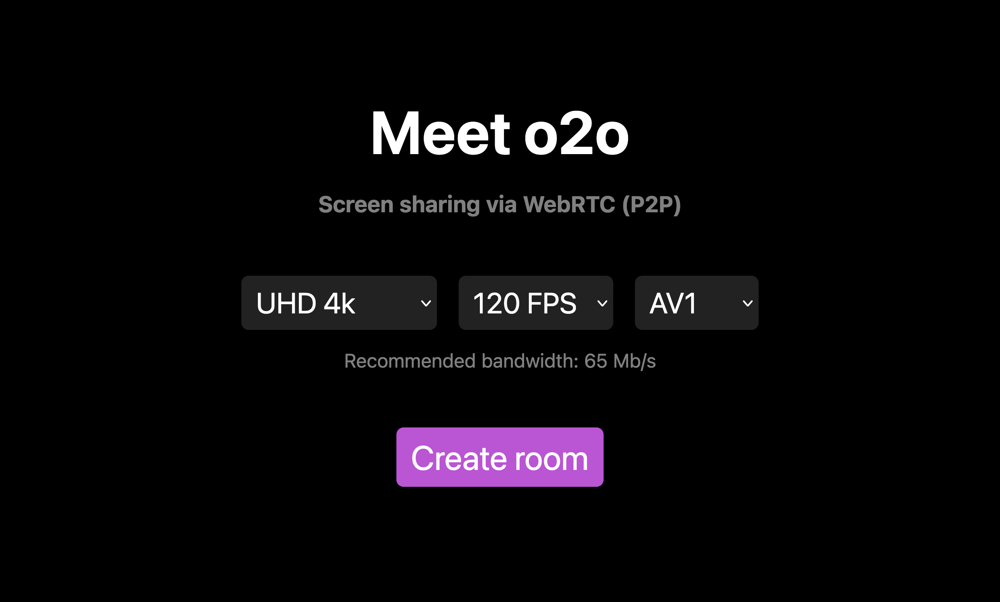
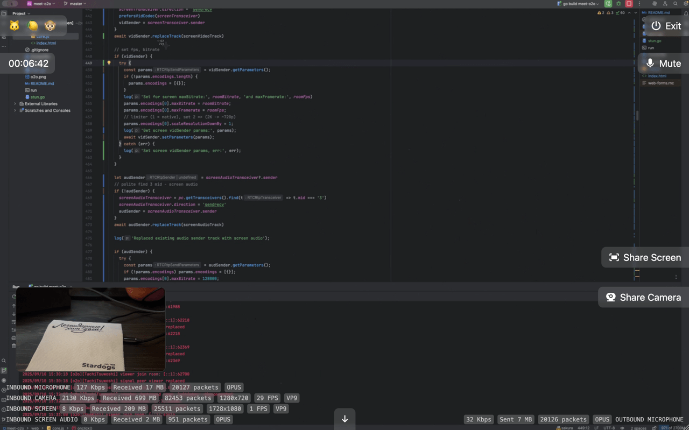

# Meet o2o

Screen sharing via Peer‑to‑peer WebRTC with microphone and camera

Demo https://meet.oxmix.net

## Launching a standalone version

```shell
git clone https://github.com/oxmix/meet-o2o.git \
&& cd meet-o2o \
&& ./run
```

Open http://localhost:8080



Room



### For self-hosted via Nginx with proxy_pass

```conf
server {
    listen 443 quic;
    listen 443 ssl;
    http2 on;
    server_name your.domain.ltd;
    ssl_certificate     /etc/ssl/...pem;
    ssl_certificate_key /etc/ssl/...key;
    location / {
        proxy_pass http://127.0.0.1:18080;
        proxy_http_version 1.1;
        proxy_set_header X-Real-IP $remote_addr;
        proxy_set_header X-Forwared-For $proxy_add_x_forwarded_for;
        proxy_set_header Upgrade $http_upgrade;
        proxy_set_header Connection "upgrade";
    }
}
```

## Note

> `STUN` = "зеркало", помогает узнать свой внешний адрес
>
> `TURN` = "ретранслятор", через него идёт медиа трафик

### Case with `STUN` (direct P2P):

```
Client A                      Client B
|                              |
|---STUN Request-------------->|  (узнаёт свой публичный IP:Port через STUN-сервер)
|<--STUN Response--------------|
|                              |
|---SDP через сигналинг--------|
|<--SDP через сигналинг--------|
|                              |
|<======= P2P Media ==========>|  (аудио/видео идёт напрямую)
|                              |
```

### Case with `TURN` (when P2P is not possible):

```
Client A                      TURN Server                   Client B
|                              |                             |
|---SDP через сигналинг--------|                             |
|                              |                             |
|---Media--------------------->|                             |
|                              |---Media-------------------->|
|<--Media----------------------|                             |
|                              |                             |
```
