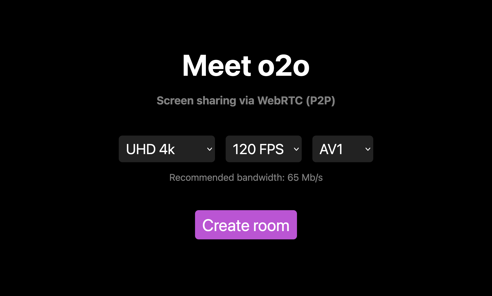
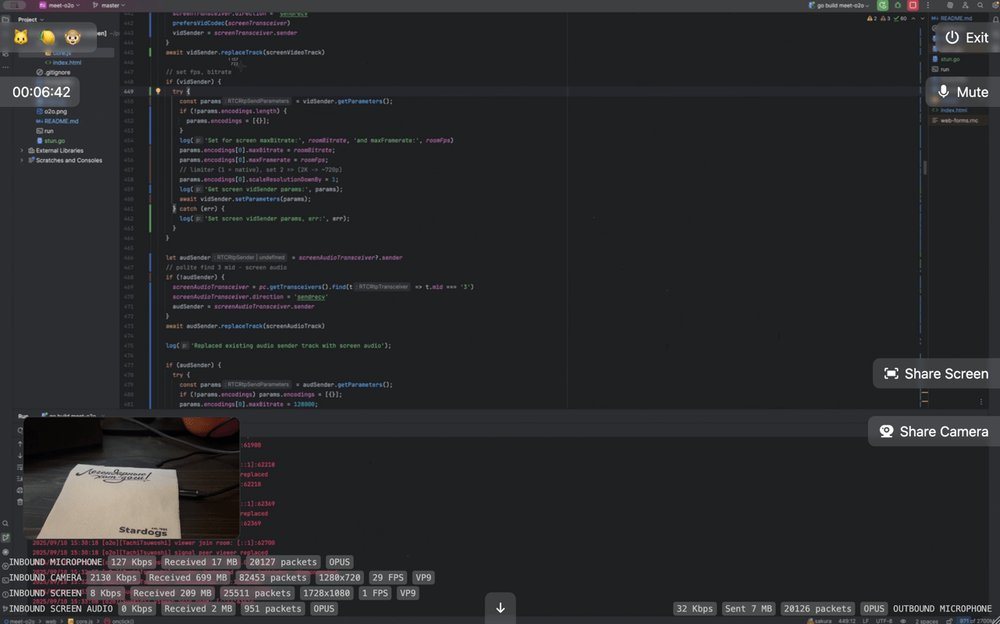

# Meet o2o

Screen sharing via Peer-to-peer WebRTC with microphone, camera, chat, and end-to-end encrypted communication

Demo https://meet.oxmix.net

## Launching a standalone version

```shell
git clone https://github.com/oxmix/meet-o2o.git \
&& cd meet-o2o \
&& ./run
```

Open http://localhost:8080



Room



### For self-hosted via Nginx with proxy_pass

```conf
server {
    listen 443 quic;
    listen 443 ssl;
    http2 on;
    server_name your.domain.ltd;
    ssl_certificate     /etc/ssl/...pem;
    ssl_certificate_key /etc/ssl/...key;
    location / {
        proxy_pass http://127.0.0.1:18080;
        proxy_http_version 1.1;
        proxy_set_header X-Real-IP $remote_addr;
        proxy_set_header X-Forwared-For $proxy_add_x_forwarded_for;
        proxy_set_header Upgrade $http_upgrade;
        proxy_set_header Connection "upgrade";
    }
}
```

## Note

### End-to-end

Через WebSocket-сигналинг передаются только публичные части DTLS-handshake — SDP содержит a=fingerprint:sha-256 ... (хэш
сертификата, не приватный ключ) и ICE-кандидаты (IP/порты).

Приватные ключи DTLS:

- Генерируются браузером локально, никогда не покидают устройство.
- Сам сеансовый ключ шифрования вырабатывается через DTLS-handshake (ECDHE) уже поверх P2P-соединения, после того как
  ICE связал пиров напрямую — сигналинг в этом обмене не участвует.

> Что мог бы сделать злонамеренный сигналинг-сервер: подменить a=fingerprint в SDP на свой и устроить MITM (классическая
> атака на DTLS-SRTP). Именно для защиты от этого в приложении показывается fingerprint-эмодзи (XOR локального и
> удалённого fingerprint) в левом верхнем углу — если у обоих участников эмодзи совпадают, MITM исключён. Это
> стандартный SAS (Short Authentication String) подход

### Case with `STUN` (direct P2P):

> `STUN` = "зеркало", помогает узнать свой внешний адрес

```
Client A                      Client B
|                              |
|---STUN Request-------------->|  (узнаёт свой публичный IP:Port через STUN-сервер)
|<--STUN Response--------------|
|                              |
|---SDP через сигналинг--------|
|<--SDP через сигналинг--------|
|                              |
|<======= P2P Media ==========>|  (аудио/видео идёт напрямую)
|                              |
```

### Case with `TURN` (when P2P is not possible):

> `TURN` = "ретранслятор", через него идёт медиа трафик

```
Client A                      TURN Server                   Client B
|                              |                             |
|---SDP через сигналинг--------|                             |
|                              |                             |
|---Media--------------------->|                             |
|                              |---Media-------------------->|
|<--Media----------------------|                             |
|                              |                             |
```
